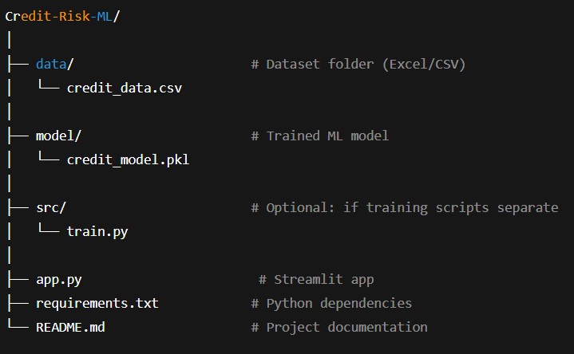

# 💳 Credit Risk Prediction

This project is an **AI/ML-powered credit risk prediction system** that predicts the likelihood of a borrower defaulting on credit obligations. It uses a **XGBoost classifier** trained on historical credit data and provides a simple **Streamlit web interface** for interactive predictions.

---

## 📂 Project Structure

---

## 📝 Features

- Predicts **probability of default** for credit borrowers.
- Classifies risk into **Very Low, Low, Medium, High** levels.
- User-friendly input via Streamlit interface.
- Easy to train/update model using `train.py`.

---

## ⚙️ Installation

## 1. Clone the repository:
- git clone https://github.com/your-username/Credit-Risk-ML.git
- cd Credit-Risk-ML

## 2. Create and activate a virtual environment:
python -m venv venv
### Windows
venv\Scripts\activate
### Linux / Mac
source venv/bin/activate

## 3. Install dependencies:
pip install -r requirements.txt

## 4. 🚀 Usage
1️⃣ Train the Model

Run the training script (optional, if you want to retrain the model):
python src/train.py
This will train the XGBoost model on data/credit_data.csv and save it to model/credit_model.pkl.

2️⃣ Run the Streamlit App
streamlit run app.py
Open the browser at the URL provided (usually http://localhost:8501) and enter borrower details to see predictions.

## 5. 🔍 How It Works
Input Features:
Revolving Credit Utilization (%)
Age (years)
Times 30-59 Days Past Due
Debt Ratio
Monthly Income ($)
Open Credit Lines & Loans
Times 90+ Days Late
Real Estate Loans/Lines
Times 60-89 Days Past Due
Number of Dependents
Prediction Output:
Prediction: Yes/No (Default Risk)
Probability of Default (%): Likelihood of default
Risk Level: Very Low / Low / Medium / High
Higher probability → higher risk of default.

## 6. 🧰 Technologies Used
Python 3.x
Pandas, Scikit-learn, XGBoost
Streamlit for web interface
Joblib for model serialization

## 7. 🛠 Future Improvements

Add feature importance visualization.
Deploy on Heroku/AWS/GCP for public access.
Include more data preprocessing & feature engineering.
Add explanation layer using SHAP or LIME for transparency.
